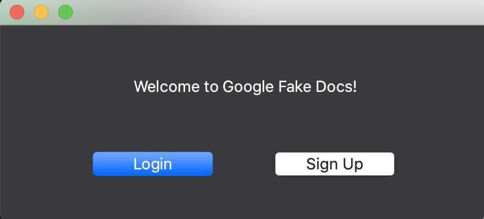
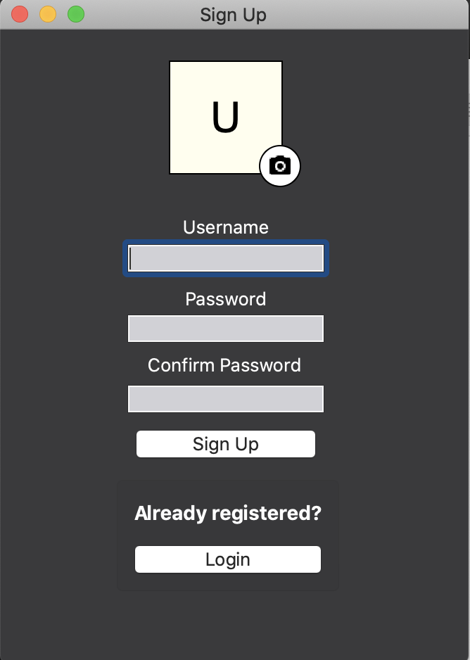
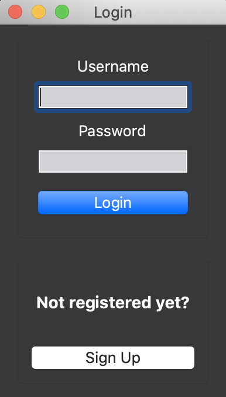
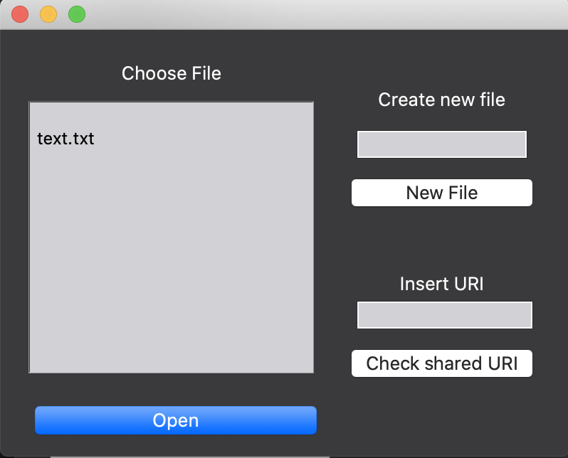
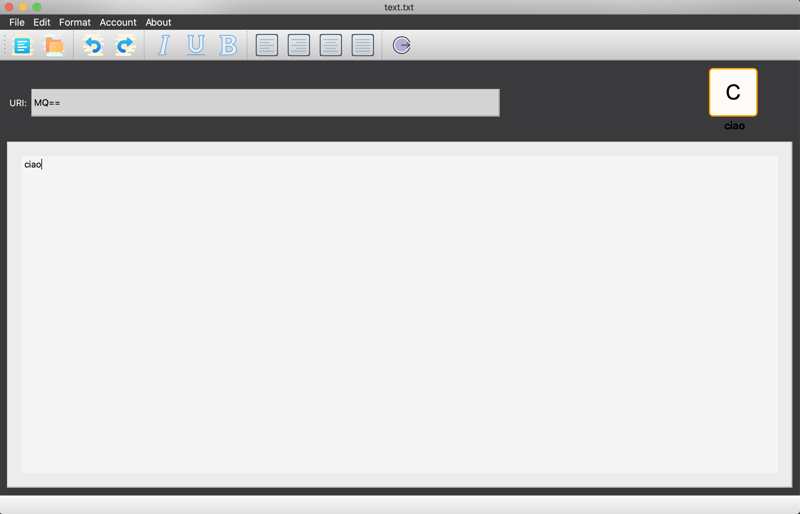

# ProgettoMalnati
Progetto per il corso di programmazione di sistema

# Editor di testo collaborativo

La disponibilità di connessioni a larga banda e l’esigenza di lavorare in gruppo senza richiedere necessariamente la compresenza degli attori nello stesso spazio fisico, spinge verso la realizzazione di sistemi di supporto al lavoro cooperativo sempre più efficaci. Ad esempio, Google mette a disposizione la suite Docs, mediante la quale è possibile editare, in modo cooperativo e distribuito, documenti di varia natura (testi, fogli di calcolo, presentazioni) ed in grado di scalare su numeri anche grandi di utenti contemporanei: tale soluzione è basata su un insieme di server centralizzati che gestiscono il traffico da e verso i singoli client e mettono in atto la logica necessaria a garantire la correttezza delle operazioni concorrenti.

Quello che abbiamo realizzato, utilizzando il linguaggio C++, è un sistema di editing testuale cooperativo che consenta a uno o più utenti di modificare il contenuto di un documento in contemporanea, garantendo che operazioni di inserimento o modifica diverse, svolte dagli utenti allo stesso tempo, producano gli stessi effetti, indipendentemente dall’ordine con cui sono eseguite sui diversi sistemi in uso (commutatività) e che cancellazioni ripetute portino allo stesso risultato (idempotenza).

## Installazione
Per l'installazione, portatevi nella sezione download del sito ufficiale della libreria  [http://qt-project.org/downloads](http://qt-project.org/downloads) e scegliete il pacchetto di installazione (SDK) per il vostro sistema operativo. Dovete scegliere inoltre anche tra l'installazione online e offline (è consigliata la soluzione offline per motivi di tempo, a meno che non possediate una connessione molto veloce). Una volta scaricato il pacchetto di installazione sequite questi semplici passi:

 1. Aprite la shell (CTRL+ALT+T) e accedete alla cartella di download dove troverete il file scaricato di estensione .run  

2. Rendete il file eseguibile con il comando shell:
   `sudo chmod +x nome-file.run`

3. Eseguite lo script:
	 `/nome-file.run`

4. Seguite la procedura guidata d'installazione, scegliendo le cartelle in cui installare il framework.

Terminata l'installazione (ci vuole un pò di pazienza), vi troverete nel percorso da voi specificato la cartella **QtSdk**, dove si trovano le librerie, la documentazione, QtCreator e tutti gli altri strumenti.

A questo punto non resta che clonare il progetto in questione attraverso il comando:

`git clone https://github.com/SimoneDutto/ProgettoMalnati.git`

Quindi lanciamo dal menu di avvio QtCreator e apriamo il nostro progetto.

## Utilizzo
Una volta avviata l'applicazione, vi ritroverete davanti a questa schermata di benvenuto:

Da qui potrete scegliere se registrarvi o, se già si possiede un account, fare il login.

Se si accede per la prima volta sarà necessario creare un profilo utente, quindi cliccare su "Sign Up":

In questa pagina vi viene chiesto di registrarvi inserendo username, password e conferma della password. E' anche possibile scegliere un'icona, nel caso in cui non venga fatto ve ne verrà assegnata una in automatico con la vostra iniziale.

Verrete poi reindirizzati alla pagina di Login:

Qui vi viene chiesto di inserire le vostre credenziali.

Cliccando sul bottone "Login" arrivete a questa schermata:

Sulla sinistra troverete una lista di file presenti nel filesystem a cui è possibile accedere. E' anche possibile inserire l'URI di un documento a cui siete stati invitati a collaborare: se il link è corretto il file apparirà tra quelli selezionabili nella lista a sinistra e potrà essere aperto. Infine potete anche decidere di creare un nuovo file.

Dopo aver scelto quale file aprire, arriverete qui:

Il vero e proprio editor di testo. Nel menu in evidenza ci sono le operazioni principali: creazione di un nuovo file, apertura file, undo, redo, le varie funzioni di arricchimento del testo (grassetto, corsivo, sottolineato, allineamento) e infine il logout. Ben visibile è anche l'URI del documento corrente, per un eventuale invito a collaborare. In alto a destra c'è l'icona dell'utente connesso e, man mano che altri utenti aprono lo stesso documento, compaiono anche le loro icone (fino a un massimo di tre utenti, dopo di che i restanti vengono aggiunti ad un contatore che, se cliccato, mostra i dettagli degli altri utenti).
